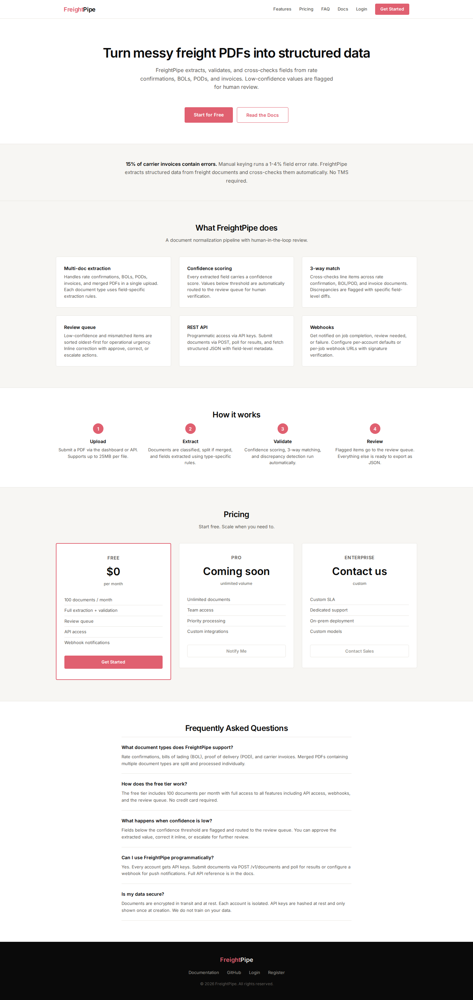
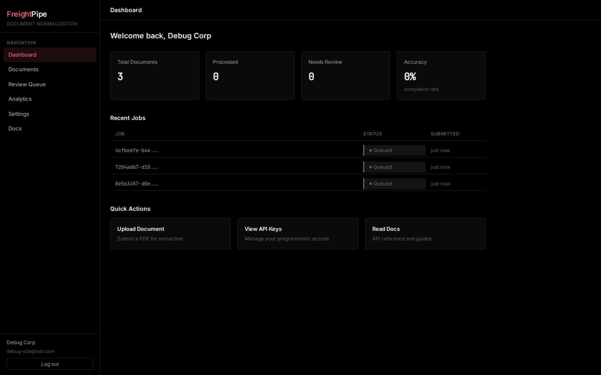
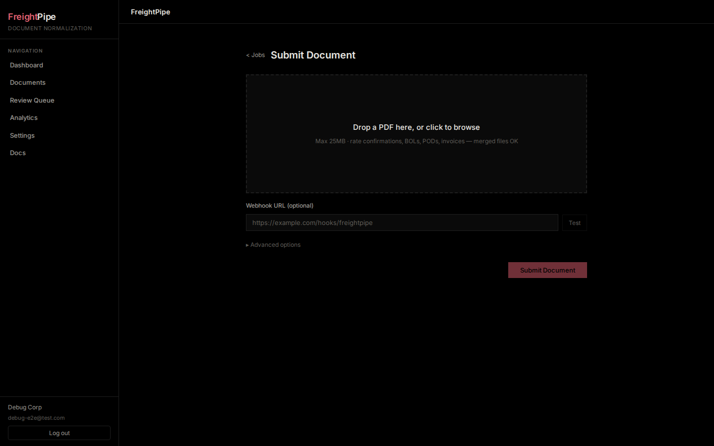
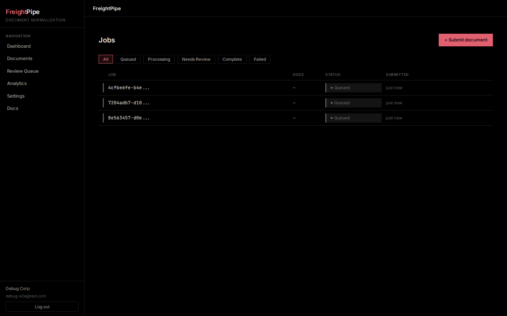

<div align="center">



# FreightPipe

**Headless freight document normalization API**

Turn messy freight PDFs into clean, validated JSON with 3-way matching — no TMS required.

[](LICENSE)
[](https://www.python.org/downloads/)

</div>

---

## The problem

Freight brokerages drown in PDFs. A single shipment generates a rate confirmation, Bill of Lading, Proof of Delivery, and carrier invoice — often merged into one messy file. Manual data entry is slow, error-prone, and doesn't scale. Existing solutions require adopting a full TMS platform, which is overkill for small operations that just need the document handling sorted.

**FreightPipe solves this.** Upload a PDF → get structured JSON with per-field confidence scores and automated 3-way matching across the shipment lifecycle.

## Screenshots

<table>
<tr>
<td align="center"><br/><em>Dashboard — job stats, recent submissions, quick actions</em></td>
<td align="center"><br/><em>Document upload — drag-and-drop with webhook support</em></td>
</tr>
<tr>
<td align="center"><br/><em>Jobs list — status filters, document counts, pipeline progress</em></td>
<td align="center"><br/><em>Product landing page</em></td>
</tr>
</table>

## What it does

- 📄 **Multi-format ingestion** — Upload rate confirmations, Bills of Lading, Proofs of Delivery, and invoices. Handles merged documents (multiple doc types in a single PDF).
- 🔍 **Intelligent extraction** — Rules-first pipeline with LLM escalation for scanned or messy documents. Deterministic regex handles clean PDFs; vision LLMs handle the fuzzy 20%.
- 🔗 **3-way match engine** — Automatically compares agreed (rate confirmation) ↔ delivered (BOL/POD) ↔ billed (invoice), flagging rate deltas, missing accessorial charges, weight variances, and piece count discrepancies.
- 📊 **Confidence scoring** — Every extracted field gets a confidence score (0–1). Items below threshold are routed to a human review queue automatically.
- ✅ **Review dashboard** — Full React UI for reviewing flagged documents with inline corrections, status tracking, and resolution notes.
- 🔌 **Provider-agnostic LLM** — Pools OpenRouter, Gemini Flash, and Groq free tiers with automatic fallback and budget tracking. No single-vendor lock-in.
- 🪝 **Webhook integration** — Configure account-level or per-job webhooks to receive real-time notifications when processing completes.
- 🔑 **API key management** — Create, list, and revoke API keys through the dashboard. Keys are hashed (SHA-256) and never stored in plaintext.

## How it works

```
Submit PDF → Classify → Split (if merged) → Extract → Normalize → Validate → Match → Review → Result
```

1. **Submit** — Upload a PDF via `POST /v1/documents` or the dashboard UI
2. **Classify** — Each document is identified as rate-con, BOL, POD, invoice, or unknown
3. **Split** — Merged PDFs are separated into individual documents by type
4. **Extract** — Fields are extracted using rules-first logic, with LLM escalation for low-confidence results
5. **Normalize** — Dates, currencies, addresses, and phone numbers are standardized
6. **Validate** — Required fields are checked, cross-document consistency is verified
7. **Match** — 3-way comparison across rate-con ↔ BOL/POD ↔ invoice with discrepancy flagging
8. **Review** — Low-confidence items enter the human review queue for correction
9. **Result** — Structured JSON with source coordinates, confidence scores, and match results

## API

| Method | Endpoint | Description |
|--------|----------|-------------|
| `POST` | `/v1/auth/register` | Create account (returns JWT + API key) |
| `POST` | `/v1/auth/login` | Sign in |
| `POST` | `/v1/documents` | Submit PDF for processing |
| `GET` | `/v1/jobs` | List all jobs (paginated) |
| `GET` | `/v1/jobs/{id}` | Poll job status |
| `GET` | `/v1/jobs/{id}/result` | Get structured output |
| `GET` | `/v1/review-queue` | List items needing review |
| `POST` | `/v1/review-queue/{id}/resolve` | Approve / correct / escalate |
| `GET` | `/v1/api-keys` | List API keys |
| `POST` | `/v1/api-keys` | Create a new API key |
| `DELETE` | `/v1/api-keys/{id}` | Revoke an API key |
| `GET` | `/v1/settings/webhook` | Get webhook config |
| `PUT` | `/v1/settings/webhook` | Set webhook config |
| `GET` | `/v1/analytics/usage` | Usage metrics |
| `GET` | `/v1/health` | Liveness check |

### Example: Submit a document

```bash
curl -X POST https://freightpipe.onrender.com/v1/documents \
  -H "Authorization: Bearer <your-jwt>" \
  -F "file=@shipment.pdf"
```

Response:
```json
{
  "job_id": "a1b2c3d4-...",
  "status": "queued",
  "created_at": "2026-08-21T12:00:00Z"
}
```

### Example: Get results

```bash
curl https://freightpipe.onrender.com/v1/jobs/{job_id}/result \
  -H "Authorization: Bearer <your-jwt>"
```

Response includes extracted fields with confidence scores, source page/bbox coordinates, and 3-way match results with discrepancy flags.

## Use cases

**Small freight brokerages** — Automate document data entry without adopting a full TMS. Upload PDFs, get structured data, review flagged items.

**Carrier back-office** — Validate invoices against rate confirmations before payment. Catch overcharges, missing accessorial fees, and weight discrepancies automatically.

**Logistics tech builders** — Use the headless API as a building block. Integrate freight document parsing into your own platform via REST.

**Audit & compliance** — Maintain a structured audit trail of every document processed, with source coordinates linking back to the original PDF.

## Tech stack

| Layer | Technology |
|-------|-----------|
| **Backend** | Python 3.11 · FastAPI · asyncpg · pdfplumber · pypdf |
| **Frontend** | React 18 · TypeScript · Vite · TanStack Query · Recharts |
| **Database** | Neon Postgres (PDFs stored as BYTEA — no external object storage) |
| **LLM** | Provider-agnostic router: OpenRouter · Gemini Flash · Groq (pooled free tiers) |
| **Auth** | JWT tokens · bcrypt password hashing · SHA-256 API key hashing |
| **Hosting** | Render (backend) · Cloudflare Pages (frontend) |

**Free tier only** — no credit card required for any service.

## Quick start

```bash
# Clone
git clone https://github.com/OCTOBER-sk/freightpipe.git
cd freightpipe

# Backend
cd backend
python -m venv .venv && source .venv/bin/activate
pip install -e .
cp .env.example .env  # fill in Neon URL + LLM keys
python -m uvicorn freightpipe.api.app:app --reload

# Frontend (separate terminal)
cd frontend
npm install
npm run dev
```

The frontend runs at `http://localhost:5173` and connects to the backend API. Register an account through the UI to get started.

## Project structure

```
freightpipe/
├── backend/
│   ├── src/freightpipe/
│   │   ├── api/          # FastAPI routes, JWT auth, rate limiting, webhooks
│   │   ├── db/           # Async connection pool, 9 repository modules
│   │   ├── llm/          # Provider-agnostic LLM router with fallback
│   │   ├── pipeline/     # Classify → split → extract → normalize → validate → match
│   │   ├── models/       # Pydantic request/response schemas
│   │   └── utils/        # Configuration and helpers
│   ├── alembic/          # Database migrations
│   └── tests/            # Backend test suite
├── frontend/
│   ├── src/
│   │   ├── components/   # 12 reusable UI components
│   │   ├── routes/       # 9 page components (dashboard, jobs, settings, etc.)
│   │   ├── api/          # Typed API client layer
│   │   └── types/        # TypeScript types synced with backend schema
│   └── dist/             # Production build
└── assets/               # Screenshots for README
```

## Design philosophy

- **Deterministic rules first, LLM escalation second** — Regex and heuristics handle the 80% of clean, structured documents. LLMs handle the fuzzy 20% — scanned pages, handwritten notes, non-standard layouts.
- **Gates before tokens** — Budget, type, and locality filters run before any document reaches the LLM. No wasted API calls.
- **Confidence-driven routing** — Every extracted field carries a confidence score. Low-confidence items are automatically routed to human review, not silently passed through.
- **Price-echo verification** — Every price in a generated draft must match the source data verbatim. No hallucinated numbers.
- **Measured, not claimed** — Accuracy targets are benchmarks to verify against a corpus, never assertions.

## Data & privacy

- **PDFs stored in-database** — Documents are stored as BYTEA in Postgres. No external object storage (S3, R2) required.
- **API keys hashed** — Keys are SHA-256 hashed before storage. The raw key is only shown once at creation.
- **LLM calls are stateless** — Document content is sent to LLM providers for extraction only. No persistent storage on the provider side.
- **JWT-based auth** — Tokens expire after 24 hours. No refresh token stored server-side.
- **No telemetry** — No analytics, tracking, or phone-home. Your data stays in your database.

## License

[MIT](LICENSE)
